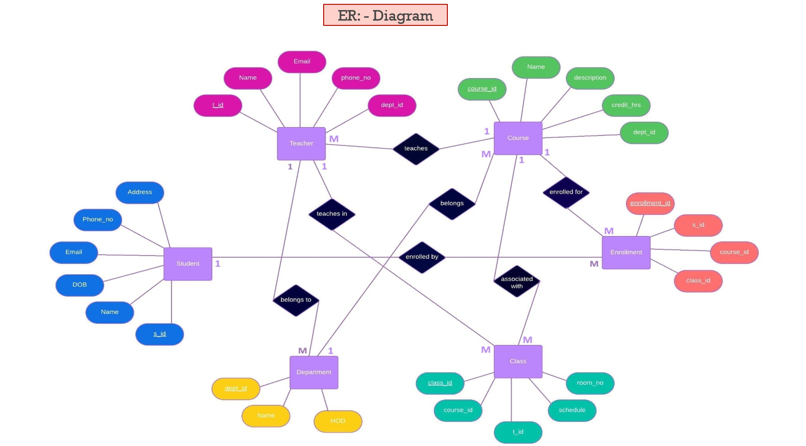
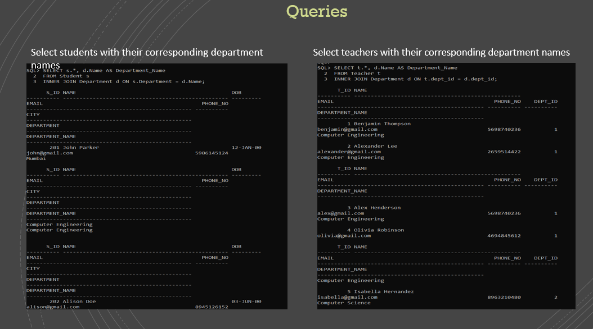

# 🎓 College Management System – DBMS Project

A relational database system to efficiently manage student, faculty, and course data, built as part of a Semester 4 academic project.

## 📌 Project Overview
- Developed a robust DBMS to manage student enrollment, faculty assignments, and course offerings.
- Implemented secure access control with role-based permissions and user authentication.
- Designed ER model and normalized SQL tables for efficient data storage.
- Optimized queries for fast reporting, grade tracking, and administration tasks.

## 🧠 Features

- **Student Management:** Registration, enrollment, profile updates, attendance, grade viewing.
- **Faculty Management:** Course assignments, grading, profile updates.
- **Course Management:** Creation, update, enrollment handling.
- **Admin Panel:** User access control, reporting, system configurations.
- **Security Layer:** RBAC, encrypted credentials, authenticated sessions.

## 🛠️ Technologies Used

- **DBMS:** MySQL / PostgreSQL
- **Backend:** Java / Python / PHP
- **Frontend:** HTML, CSS, JavaScript
- **Tools:** SQL, ER Diagram, Stored Procedures

## 📷 Screenshots

### ER Diagram

### SQL Queries

## 📈 Future Enhancements

- Mobile App support
- Integration with Learning Management Systems (LMS)
- Advanced student analytics

## 🙌 Developed By 
- Aaliya Khan 
- NMIMS MPSTME
 
